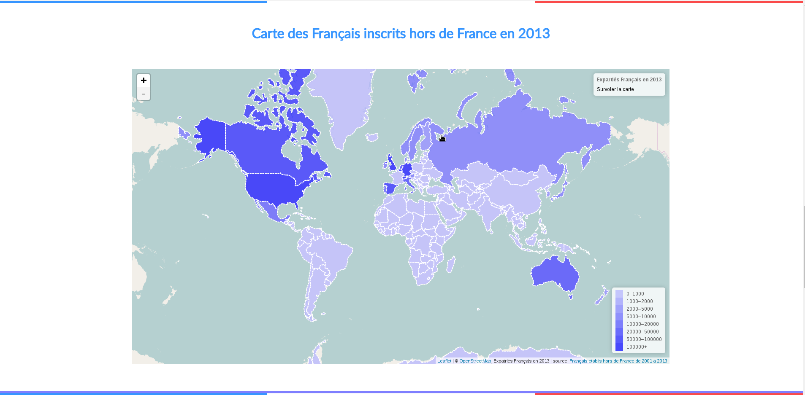

# Carte des Français inscrits hors de France de 2001 à 2013

Cette page web permet d'afficher deux cartes avec Lefleat à partir des données recueillies sur le site [opendata.gouv](https://www.data.gouv.fr/fr/datasets/francais-de-l-etranger-inscriptions-au-registre-des-francais-etablis-hors-de-france-2001-2013/).

# Prérequis pour afficher la page

- installer nodejs
- lancer `npm install` pour installer les dépendances
- lancer gulp `gulp build` pour créer les fichiers

# Comment afficher la page ?

- lancer nodejs `gulp serve`
- dans le navigateur taper **http://127.0.0.1:8080/pages/**

# TODO

- [ ] Fusionner les fichiers json
- [ ] Finir le graph d3js en bas de page
- [ ] Mettre un graph d3js dans les openPopup sur la première carte Lefleat
